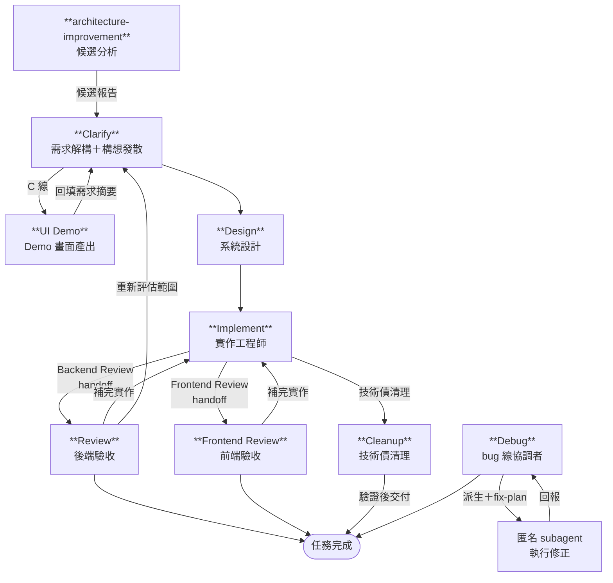

# AI 全域設定 (.ai-agents)

本目錄為個人全域 AI 輔助開發設定，適用於 Claude Code、Codex 等工具，內容充滿個人習慣與偏好，僅供參考。

**本專案必須 clone 至 `~/.ai-agents/`，setup script 與各工具連結皆依賴此路徑：**

```bash
git clone https://github.com/CloudyWing/ai-dotfiles.git ~/.ai-agents
```

---

## 1. 核心概念對照

| 概念 | 定位 | 何時生效 | 用途 |
| --- | --- | --- | --- |
| **Rule** | 規範文件 | 始終生效（自動注入每次對話） | 強制編碼規範、風格約束，AI 無法繞過 |
| **Skill** | 專門能力模組 | 知識型：AI 自動載入；指令型：使用者以 `/` 呼叫 | 封裝知識規範、可執行任務，支援腳本與資源 |
| **Agent** | 獨立代理人設定 | 依設定檔觸發或手動指定 | 定義 AI 角色、行為框架與可用工具 |

### 本專案策略

- 以 `instructions.md` 作為唯一主規則檔（Single Rule）。
- Commit 訊息生成以 `skills/generate-commit/` Skill 形式獨立管理，不再列為頂層 Rule。
- 暫不拆分更多獨立 rule 檔案，避免維護成本升高。

### 平台分工

Persona Agent（Clarify、Implement、Editor、Debug）以語意切換方式執行；執行型 agent 中 Design 與 UI Demo 於 Claude 端派生，Implement、Review、Frontend Review、API Contract、Cleanup、Debug 於 Codex 端執行。`survey` 改以 Skill 形式提供文件掃描與索引產生流程。建議功能線在 Claude Code 處理 Clarify / Design，Design 驗收通過後由 Claude 端主 Agent 派生 sub-agent 背景執行 `codex app-server` 發動 Implement / Review 鏈，不需手動切換平台；bug 由 Codex 的 Debug 線診斷與修正。架構改善由獨立的 `architecture-improvement` Skill 先產出候選報告，再決定是否進入設計與實作。

涉及畫面的需求由 Clarify 判定 UI 線別，版面複雜或需對外溝通時派生 UI Demo 產出 Demo 畫面。畫面相關工作另受 `uiux` skill 約束，該 skill 平常依觸發語自動載入；判斷本輪工作涉及畫面而它未被載入時，可直接以 `/uiux` 手動強制載入。

### 本地檔案慣例（不 commit）

`.local/` 與 `.local.` 後綴表示「本機私有、不進版控」，前者收納 AI 工作產物，後者保存本機覆寫設定：

| 檔案 | 用途 | 說明 |
| --- | --- | --- |
| `AGENTS.md` | 專案共享規範 | 專案層規則與 `AI-DECLARATIONS` 宣告，依專案版控策略管理 |
| `AGENTS.local.md` | 個人對此專案的偏好覆寫 | 僅影響目前專案，不取代專案共享規範 |
| `CONTEXT.local.md` | Session 上下文交接 | 可選的本機交接檔；僅記錄跨 session 仍有效的環境前置作業、本機限制與已知陷阱 |
| `GLOSSARY.md` | 專案專屬業務術語 | 由 `glossary` skill 依使用者確認維護 |
| `docs/adr/` | Architecture Decision Record | 由 `adr` skill 依決策門檻追加 |

`.local/` 與 `*.local.md` 由機器層 `git-global-excludes` 排除。專案既有 `.gitignore` 保留專案自己的排除規則。`team` 模式另外將 `AGENTS.md`、`GLOSSARY.md` 與 `docs/adr/` 追加至目前 clone 的 `.git/info/exclude`；`solo` 模式不自動修改這三項路徑的版控狀態。

排除規則分三層。機器層負責所有 clone 共用的 `.local/` 與 `*.local.md`，repository-local 層的 `.git/info/exclude` 負責 team 模式的三項專案層檔案，專案層 `.gitignore` 只保留專案自身規則。Setup 不把機器層規則複製到 `.gitignore` 或 `.git/info/exclude`。

`.local/` 目錄結構如下：

```text
.local/
├── ai-context/                         # AI 脈絡索引產物
└── ai-sessions/
    ├── handoff/
    ├── report/
    ├── history/
    ├── scratch/
    ├── backups/
    ├── inputs/
    ├── screenshots/
    ├── style-baselines/
    └── ui-demo/
```

結案清理會移除 `scratch/` 全部內容。`handoff/<lineSlug>/` 中的 `line.json`、`requirement-summary.md` 與 `design.md` 均受保護，其他 handoff 項目依清理規則移除。`report/`、`history/`、`backups/`、`inputs/`、`screenshots/`、`style-baselines/` 與 `ui-demo/` 保留供後續查閱。

### `work-root` 與交接檔

`.local/ai-sessions/handoff/`、`.local/ai-sessions/report/`、各類交接與審查文件，以及 `CONTEXT.local.md`，都應綁定在本輪任務的 `work-root`。Clarify 會從已確認需求摘要推導並登記語意化 `lineSlug`，每一條線以 `handoff/<lineSlug>/line.json` 識別。需求基準位於 `handoff/<lineSlug>/requirement-summary.md`，設計基準位於 `handoff/<lineSlug>/design.md`，固定名稱審查與驗證報告位於 `report/<lineSlug>/`。`dispatchSlug` 只識別單次派遣，與 `lineSlug` 分開使用。判定流程分兩步：

1. **先取得 `task anchor`**（本輪任務真正想處理的範圍，不等於 AI 的 process cwd）。優先序：
   1. 使用者本輪明確指定的目錄、檔案所在目錄、或子系統 / 前端 app / 後端 service / 模組目錄。
   2. 對話上下文明確延續的已討論檔案或目錄。
   3. 以上皆無時，才退到目前工作區目錄。
2. **再從 `task anchor` 往外推導 `work-root`**：最近的技術棧根標記 → `git root` → `task anchor` 本身。

技術棧根標記：

- .NET：`*.sln`、`*.slnx`、`*.csproj`
- Node / 前端：`package.json`
- Python：`pyproject.toml`、`requirements.txt`
- Java：`pom.xml`、`build.gradle`、`settings.gradle`
- Go：`go.mod`

---

## 2. Windows 連結類型對照表

本專案使用 **Symbolic Link (符號連結)** 來實現跨工具共用設定檔。

| 特性 | Shortcut (捷徑) | Hard Link (實體連結) | Junction Point (連接點) | Symbolic Link (符號連結) |
| --- | --- | --- | --- | --- |
| 支援對象 | 檔案與資料夾 | **僅限檔案** | **僅限資料夾** | 檔案與資料夾 |
| 跨磁碟機 | 支援 | ❌ | 支援 | 支援 |
| 對程式透明 | ❌ 視為獨立檔案 | ✅ | ✅ | ✅ |
| 刪除本尊後 | 捷徑失效 | **內容還在** | 連結失效 | 連結失效 |

> **建立時需要系統管理員權限建立 Symbolic Link。**

---

## 3. 各家 AI 工具全域設定位置

### Claude Code — `~/.claude/`

| 路徑 | 用途 |
| --- | --- |
| `CLAUDE.md` | 全域記憶與指令（Claude Code 會自動讀取） |
| `skills/<name>/SKILL.md` | Skills（知識型自動載入；指令型以 `/skill-name` 呼叫） |
| `agents/*.md` | 全域自訂 Persona 與 Claude 端 sub-agent |
| `settings.json` | Hook 設定（工具呼叫前後的自動化行為） |

#### Claude Code Hook 設定

Hook 透過 `~/.claude/settings.json` 設定，於工具呼叫前後自動執行 Shell 命令，輸出文字會被注入回 Claude 的上下文。

本專案啟用一個 PostToolUse Hook，腳本放置於 `~/.ai-agents/scripts/hooks/`：

| Hook 腳本 | 觸發條件 | 用途 |
| --- | --- | --- |
| `post-edit-write-hook.ps1` | Edit 或 Write 工具寫入檔案後 | 提示執行 check-markdown skill（`.md`）；驗證 BOM 規範（`.ps1`/`.csv` 需有 BOM，`.md`/`.json` 等不可有 BOM） |

`~/.claude/settings.json` 範例（路徑請改為實際使用者名稱）：

```json
{
  "hooks": {
    "PostToolUse": [
      {
        "matcher": "Edit|Write",
        "hooks": [
          {
            "type": "command",
            "command": "powershell -NonInteractive -File C:/Users/<帳號>/.ai-agents/scripts/hooks/post-edit-write-hook.ps1"
          }
        ]
      }
    ]
  }
}
```

> `settings.json` 不由 `Setup-AIGlobalConfig.ps1` 自動建立，需手動建立並填入實際路徑。

### Codex — `~/.codex/`（或 `$CODEX_HOME`）

| 檔案 | 用途 |
| --- | --- |
| `AGENTS.md` | 全域指令檔（Codex 會載入） |
| `AGENTS.override.md` | 全域覆蓋檔（若存在且非空會優先套用） |

| 路徑 | 用途 |
| --- | --- |
| `agents/<name>.toml` | 自訂 Agent（執行型，以 `/agent <name>` 切換） |
| `~/.agents/skills/<name>/SKILL.md` | 使用者技能（Codex 會掃描） |

#### Codex CLI 前置需求

額度快照由主 Agent 於每次派工前執行 `~/.ai-agents/scripts/Get-CodexQuota.ps1`，從 `$CODEX_HOME/sessions/` 的 rollout 記錄自動讀取。

- 跨平台派工需要在 PATH 上找到 `codex`。桌面版隨附 binary 不作為派工執行檔。
- 啟動 app-server 前執行 `codex --cd . --sandbox workspace-write app-server --help`，確認目前 CLI 支援 direct app-server JSON-RPC over JSONL。
- PowerShell Transport 使用 `ProcessStartInfo.ArgumentList` 與 UTF-8 stdin／stdout／stderr；Transport 啟動端需要 PowerShell 7+。
- 使用 `npm i -g @openai/codex` 安裝 Codex CLI，更新使用 `codex update`。
- 桌面版 `bin\codex.exe` 版本固定在安裝當下，不會隨桌面版更新，不能用於跨平台派工。
- 更換機器後，第一步執行 `codex doctor`，確認執行檔、PATH 與本機設定可用。

#### Codex profile 檔位設定

1. 預設檔位省略 `-p`；`deep` 檔位使用 `-p deep`，只保留預設與 `deep` 兩個選項。
2. `deep` 只在任務需要自行找路、探索未知相依性或處理步驟未明確的多步驟問題，且 `primary` 與 `secondary` 兩個額度視窗的剩餘百分比均大於或等於 15% 時使用。
3. `deep` 的本機設定檔為 `~/.codex/deep.config.toml`，只包含兩個頂層鍵 `model` 與 `model_reasoning_effort`。設定範例如下：

   ```toml
   model = "gpt-5.6-terra"
   model_reasoning_effort = "max"
   ```

4. Codex 0.134.0 起，`--profile` 改讀獨立檔案。`config.toml` 內的 `[profiles.*]` 為 legacy 格式，該版本以後不再受理。
5. 檔位檔屬本機設定，不進版控，換機器需重新建立。`Setup-AIGlobalConfig.ps1` 的環境檢查段只偵測 `deep.config.toml` 缺件並印出修復指引。

---

## 4. 目錄結構總覽

```plaintext
~/.ai-agents/
├── .gitignore                          # 版控排除清單
├── .gitattributes                      # 行尾格式與二進位標記
├── README.md                           # 本文件
├── instructions.md                     # 核心開發規範（主 Rule）
├── docs/                               # 詳細索引與補充說明文件
├── git-global-excludes                 # 機器層 Git 排除清單
├── agents/
│   ├── claude/                         # Claude 端 Persona 與 sub-agent（.md 格式）
│   └── codex/                          # Codex 端 Persona 與 sub-agent（.toml 格式）
├── skills/                             # 技能模組（Skill）
├── templates/                          # 新專案初始化範本與 Demo 外框範本
└── scripts/                            # 安裝、檢查與 hooks 腳本
```

---

## 5. Scripts 與命名慣例

- `scripts/` 根目錄下可由使用者直接執行的 PowerShell 腳本，使用 `Verb-Noun.ps1` 命名。
- `scripts/hooks/` 內由工具自動呼叫的 Hook 腳本，使用全小寫 kebab-case 命名。
- `.githooks/` 內為 Git 原生 Hook，由 `Setup-AIGlobalConfig.ps1` 透過 `core.hooksPath` 啟用。

### Git Hook 設定

執行 `Setup-AIGlobalConfig.ps1` 時會自動完成以下設定：

```powershell
git config core.hooksPath .githooks
```

啟用後，每次 `git commit` 會自動執行 `.githooks/Update-Docs.ps1`，重新產生 `docs/agents.md`、`docs/skills.md` 與 `instructions.md` 的 Skill 指標索引並納入本次 commit。`docs/agents.md` 與 `docs/skills.md` 為生成檔，請勿手動編輯；表格會列出讀者欄，Skill 另依 `user-invoked` 與 `model-invoked` 分組。腳本會先驗證 `disable-model-invocation` 與 `policy.allow_implicit_invocation` 的語意一致性，並檢查 `agents/codex/*.toml` 的頂層 bare key 是否超出 `name`／`description`／`developer_instructions` 白名單，任一項不符時以非零結束碼阻止 commit。Codex agent 的 `audience` 以 `# doc-meta: audience = "..."` 註解承載，避免頂層鍵使 Codex 丟棄整份定義。agent 的 Persona／sub-agent 分類由 `Update-Docs.ps1` 的 `$personaAgents` 清單決定。

---

## 6. 內建 Skill 清單

詳見 [docs/skills.md](./docs/skills.md)。

Skill 分為兩種類型：

- **知識型**：Claude 依上下文自動載入並套用（如編碼規範、LINQ 查詢規則）。
- **指令型**：須使用者以 `/skill-name` 明確觸發（如 `/generate-changelog-zh-tw`、`/generate-unit-test`）。

`docs/skills.md` 將 Skill 依 `user-invoked` 與 `model-invoked` 分組，並列出 Skill 的讀者欄。讀者值為 `agent` 或 `human`，用來區分規範載入對象與人員直接使用的任務模組。

`.githooks/Update-Docs.ps1` 會將所有 Skill 名稱與說明同步到 `instructions.md` 的 `SKILL-INDEX` 區塊。腳本只替換 BEGIN／END 標記之間的內容，保留區塊外的主規則。frontmatter 的雙端觸發欄位不一致時，腳本會以非零結束碼停止 commit。

Claude Code 與 Codex 對「可呼叫的任務模組」各有不同名稱，且已逐漸整併成指令型 Skill：

| 工具 | 原始術語 |
| --- | --- |
| Claude Code | Command（`commands/*.md`） |
| Codex | Skill（`skills/*/SKILL.md`） |

---

## 7. 內建 Agent 清單

詳見 [docs/agents.md](./docs/agents.md)。

Agent 依執行平台分為兩類：

- **Persona**：以語意切換方式執行。適合需要多輪對話、強依賴上下文的需求分析、實作階段控制與文件編輯。
- **sub-agent**：由主 Agent 派生。適合有明確輸入與交接檔案的設計、審查、掃描與清理任務。
- **Cleanup**：Codex 執行型 agent，處理語法現代化、死程式碼、資源管理與既有規範清理；每批修改後驗證測試。
- **architecture-improvement**：人員明確觸發的 Skill，依 Git hotspot 與 deletion test 縮小候選範圍，先產出 `.local/ai-sessions/report/<lineSlug>/architecture-review.md` 再等待範圍決策。

### Agent 執行流程



> 功能線：Clarify 收斂需求後由 Design 設計，設計驗收通過後由主 Agent 依 §1.5 跨平台派工發動 `codex app-server` 進入實作與審查循環。判定為 C 線時，Clarify 先派生 UI Demo 產出 Demo 畫面，驗收並回填需求摘要後再進入 Design。Cleanup 只處理程式碼技術債與語法現代化。`architecture-improvement` 先產出候選報告，確認範圍後才進入設計。bug 線：Debug 診斷後派生匿名 subagent 修正並驗收。

---

## 8. 疑難排解

### `model_reasoning_effort` 版本相容性

Codex 0.130 只接受 `model_reasoning_effort` 為 `none`、`minimal`、`low`、`medium`、`high` 或 `xhigh`。設定為 `max` 時，會在讀取 `config.toml` 階段整份載入失敗，任何子命令皆無法執行。Codex 0.147 已接受 `max`。

若對桌面版隨附 binary 執行 `codex update`，會回傳下列訊息：

```text
Could not detect the Codex installation method
```

請改用 npm 全域安裝的 Codex CLI，並以 `codex --version` 確認 PATH 解析到正確的執行檔。

## License

This project is licensed under the [MIT License](./LICENSE.md).
