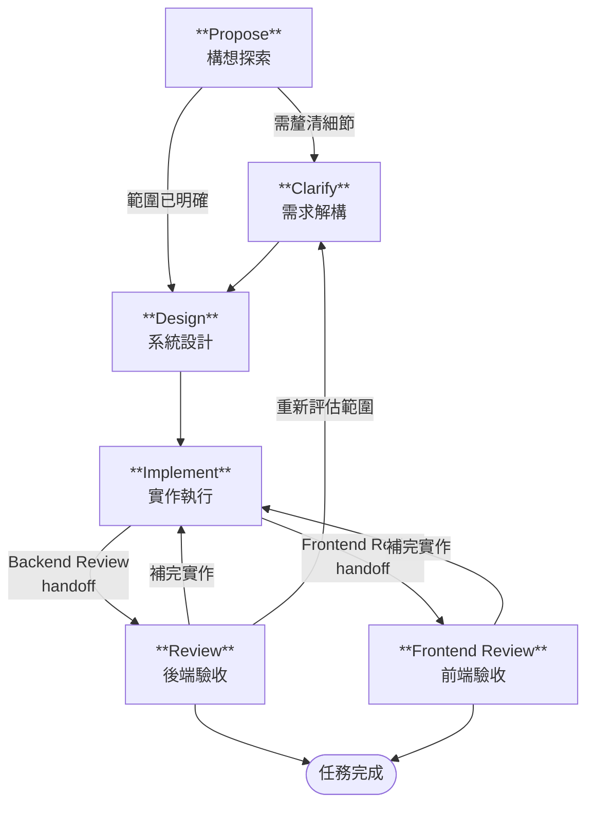

# AI 全域設定 (.ai-agents)

本目錄為個人全域 AI 輔助開發設定，適用於 Claude Code、Codex、Gemini CLI、Antigravity 等工具，內容充滿個人習慣與偏好，僅供參考。

**本專案必須 clone 至 `~/.ai-agents/`，setup script 與各工具連結皆依賴此路徑：**

```bash
git clone https://github.com/CloudyWing/ai-dotfiles.git ~/.ai-agents
```

---

## 1. 核心概念對照

| 概念 | 定位 | 何時生效 | 用途 |
| --- | --- | --- | --- |
| **Rule** | 規範文件 | 始終生效（自動注入每次對話） | 強制編碼規範、風格約束，AI 無法繞過 |
| **Skill** | 專門能力模組 | 知識型：AI 自動載入；指令型：使用者以 `/` 呼叫 | 封裝知識規範、可執行任務，支援腳本與資源 |
| **Agent** | 獨立代理人設定 | 依設定檔觸發或手動指定 | 定義 AI 角色、行為框架與可用工具 |

### 本專案策略

- 以 `instructions.md` 作為唯一主規則檔（Single Rule）。
- Commit 訊息生成以 `skills/generate-commit/` Skill 形式獨立管理，不再列為頂層 Rule。
- 暫不拆分更多獨立 rule 檔案，避免維護成本升高。

### 平台分工

討論型 Agent（Clarify、Design、Propose、Editor、Debug）在 Claude Code 執行；執行型 Agent（Implement、Review、Frontend Review、API Contract、Survey、Cleanup）在 Codex 執行。

### 本地檔案慣例（不 commit）

`.local.` 後綴表示「本機私有、不進版控」，對應兩種用途：

| 檔案 | 用途 | 說明 |
| --- | --- | --- |
| `AGENTS.local.md` | 個人私有 AI 規則 | 覆蓋 `instructions.md` 的個人偏好 |
| `CONTEXT.local.md` | Session 上下文交接 | 記錄當前任務進度、踩過的坑與環境狀態，跨 session 延續用（自行定義，非業界標準） |

兩個檔案均已列入 `.gitignore`，適用於本目錄及各專案根目錄。

---

## 2. Windows 連結類型對照表

本專案使用 **Symbolic Link (符號連結)** 來實現跨工具共用設定檔。

| 特性 | Shortcut (捷徑) | Hard Link (實體連結) | Junction Point (連接點) | Symbolic Link (符號連結) |
| --- | --- | --- | --- | --- |
| 支援對象 | 檔案與資料夾 | **僅限檔案** | **僅限資料夾** | 檔案與資料夾 |
| 跨磁碟機 | 支援 | ❌ | 支援 | 支援 |
| 對程式透明 | ❌ 視為獨立檔案 | ✅ | ✅ | ✅ |
| 刪除本尊後 | 捷徑失效 | **內容還在** | 連結失效 | 連結失效 |

> **建立時需要系統管理員權限建立 Symbolic Link。**

---

## 3. 各家 AI 工具全域設定位置

### Gemini CLI — `~/.gemini/`

| 檔案 | 用途 |
| --- | --- |
| `GEMINI.md` | 全域規則：注入每次對話的核心指令 |
| `settings.json` | CLI 偏好設定（模型、主題、語言等） |

### Antigravity — `~/.gemini/antigravity/`

| 資料夾 | 用途 |
| --- | --- |
| `global_workflows/` | 跨專案可用的 Workflow 定義 |

### Claude Code — `~/.claude/`

| 路徑 | 用途 |
| --- | --- |
| `CLAUDE.md` | 全域記憶與指令（Claude Code 會自動讀取） |
| `skills/<name>/SKILL.md` | Skills（知識型自動載入；指令型以 `/skill-name` 呼叫） |
| `agents/*.md` | 全域自訂 Agent（討論型，可用 `@agent-name` 呼叫） |
| `settings.json` | Hook 設定（工具呼叫前後的自動化行為） |

#### Claude Code Hook 設定

Hook 透過 `~/.claude/settings.json` 設定，於工具呼叫前後自動執行 Shell 命令，輸出文字會被注入回 Claude 的上下文。

本專案啟用一個 PostToolUse Hook，腳本放置於 `~/.ai-agents/scripts/hooks/`：

| Hook 腳本 | 觸發條件 | 用途 |
| --- | --- | --- |
| `post-edit-write-hook.ps1` | Edit 或 Write 工具寫入檔案後 | 提示執行 check-markdown skill（`.md`）；驗證 BOM 規範（`.ps1`/`.csv` 需有 BOM，`.md`/`.json` 等不可有 BOM） |

`~/.claude/settings.json` 範例（路徑請改為實際使用者名稱）：

```json
{
  "hooks": {
    "PostToolUse": [
      {
        "matcher": "Edit|Write",
        "hooks": [
          {
            "type": "command",
            "command": "powershell -NonInteractive -File C:/Users/<帳號>/.ai-agents/scripts/hooks/post-edit-write-hook.ps1"
          }
        ]
      }
    ]
  }
}
```

> `settings.json` 不由 `Setup-AIGlobalConfig.ps1` 自動建立，需手動建立並填入實際路徑。

### Codex — `~/.codex/`（或 `$CODEX_HOME`）

| 檔案 | 用途 |
| --- | --- |
| `AGENTS.md` | 全域指令檔（Codex 會載入） |
| `AGENTS.override.md` | 全域覆蓋檔（若存在且非空會優先套用） |

| 路徑 | 用途 |
| --- | --- |
| `agents/<name>.toml` | 自訂 Agent（執行型，以 `/agent <name>` 切換） |
| `~/.agents/skills/<name>/SKILL.md` | 使用者技能（Codex 會掃描） |

#### Codex Hook 設定

Hook 透過 `~/.codex/hooks.json` 設定，需手動建立並填入實際路徑。Hook 腳本放置於 `~/.ai-agents/scripts/hooks/`。

啟用 hooks 功能須在 `~/.codex/config.toml` 中加入：

```toml
[features]
codex_hooks = true
```

`~/.codex/hooks.json` 範例（路徑請改為實際使用者名稱）：

```json
{
  "PostToolUse": [
    {
      "matcher": "apply_patch",
      "hooks": [
        {
          "type": "command",
          "command": "pwsh -NonInteractive -File C:/Users/<帳號>/.ai-agents/scripts/hooks/codex-post-patch-hook.ps1"
        }
      ]
    }
  ]
}
```

> `hooks.json` 不由 `Setup-AIGlobalConfig.ps1` 自動建立，需手動建立並填入實際路徑。

---

## 4. 目錄結構總覽

```plaintext
~/.ai-agents/
├── .gitignore                          # 版控排除清單
├── .gitattributes                      # 行尾格式與二進位標記
├── README.md                           # 本文件
├── instructions.md                     # 核心開發規範（主 Rule）
├── docs/                               # 詳細索引與補充說明文件
├── agents/
│   ├── claude/                         # 討論型 Agent（.md 格式，連結至 ~/.claude/agents/）
│   └── codex/                          # 執行型 Agent（.toml 格式，連結至 ~/.codex/agents/）
├── skills/                             # 技能模組（Skill）
├── templates/                          # 新專案初始化範本
└── scripts/                            # 安裝、檢查與 hooks 腳本
```

---

## 5. Scripts 與命名慣例

- `scripts/` 根目錄下可由使用者直接執行的 PowerShell 腳本，使用 `Verb-Noun.ps1` 命名。
- `scripts/hooks/` 內由工具自動呼叫的 Hook 腳本，使用全小寫 kebab-case 命名。
- `.githooks/` 內為 Git 原生 Hook，由 `Setup-AIGlobalConfig.ps1` 透過 `core.hooksPath` 啟用。

### Git Hook 設定

執行 `Setup-AIGlobalConfig.ps1` 時會自動完成以下設定：

```powershell
git config core.hooksPath .githooks
```

啟用後，每次 `git commit` 會自動執行 `.githooks/Update-Docs.ps1`，重新產生 `docs/agents.md`、`docs/skills.md` 並納入本次 commit。

---

## 6. 內建 Skill 清單

詳見 [docs/skills.md](./docs/skills.md)。

Skill 分為兩種類型：

- **知識型**：Claude 依上下文自動載入並套用（如編碼規範、LINQ 查詢規則）。
- **指令型**：須使用者以 `/skill-name` 明確觸發（如 `/generate-changelog-zh-tw`、`/generate-unit-test`）。

各家 AI 工具對「可呼叫的任務模組」各有不同名稱，且已逐漸整併成指令型 Skill：

| 工具 | 原始術語 |
| --- | --- |
| Claude Code | Command（`commands/*.md`） |
| Antigravity | Workflow（`global_workflows/`） |
| Codex | Skill（`skills/*/SKILL.md`） |

---

## 7. 內建 Agent 清單

詳見 [docs/agents.md](./docs/agents.md)。

Agent 依執行平台分為兩類：

- **討論型（Claude）**：放置於 `agents/claude/`，連結至 `~/.claude/agents/`，以 `@agent-name` 呼叫。適合需要多輪對話的需求分析、系統設計、文件編輯等任務。
- **執行型（Codex）**：放置於 `agents/codex/`，連結至 `~/.codex/agents/`，以 `/agent <name>` 切換。適合程式碼實作、審查、掃描等批次執行任務。

### Agent 執行流程



> Propose → Design 為 Claude 討論階段；Design → Implement 以後切換至 Codex 執行。

---

## License

This project is licensed under the [MIT License](./LICENSE.md).
